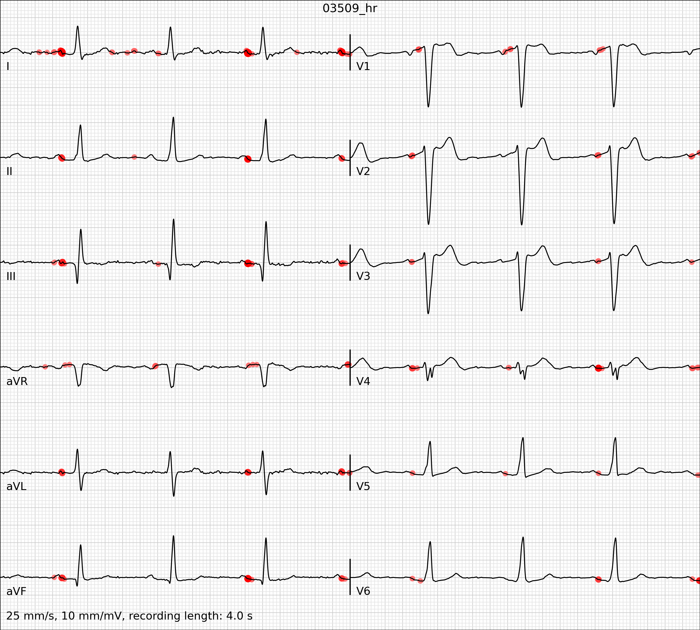
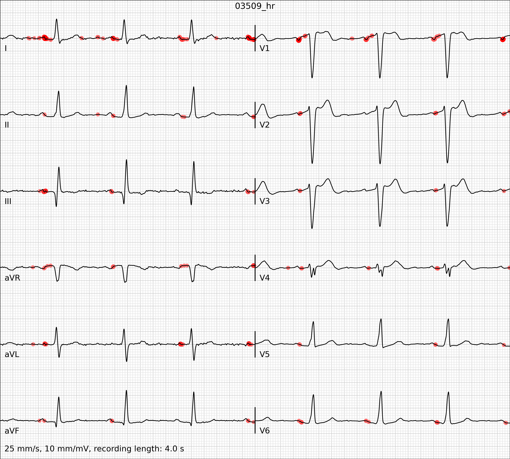
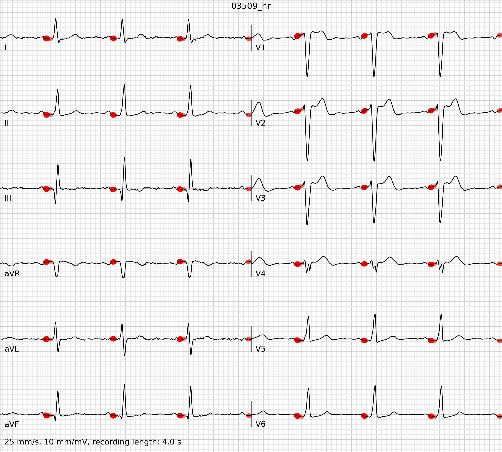

# AIME2024
Towards Trustworthy AI in Cardiology - Supplementary Material (AIME2024)

% --- AVB ---

## Atrioventricular block

*ECG subsample from PTB-XL (Wagner et al. 2020) with heatmap overlay (red) based on XAI method Gradient (Zurada et al.) for predicted class _atrioventricular block_ (prob. 97%).*

*ECG subsample from PTB-XL (Wagner et al. 2020) with heatmap overlay (red) based on XAI method Gradient×Input (Shrikumar et al. 2017) for predicted class _atrioventricular block_ (prob. 97%).*

*ECG subsample from PTB-XL (Wagner et al. 2020) with heatmap overlay (red) based on XAI method Gradient×SIGN (Gumpfer et al. 2023) for predicted class _atrioventricular block_ (prob. 97%).*

*ECG subsample from PTB-XL (Wagner et al. 2020) with heatmap overlay (red) based on XAI method LRP-α₁β₀ (Bach et al. 2015) for predicted class _atrioventricular block_ (prob. 97%).*

*ECG subsample from PTB-XL (Wagner et al. 2020) with heatmap overlay (red) based on XAI method LRP-ε with ε = 0.5 ⋅ σ(x) (Bach et al. 2015) for predicted class _atrioventricular block_ (prob. 97%).*

*ECG subsample from PTB-XL (Wagner et al. 2020) with heatmap overlay (red) based on XAI method LRP-ε SIGN with ε = 0.5 ⋅ σ(x) and SIGN as input layer rule (Gumpfer et al. 2023) for predicted class _atrioventricular block_ (prob. 97%).*

*ECG subsample from PTB-XL (Wagner et al. 2020) with heatmap overlay (red) based on XAI method DeepSHAP (Lundberg et al.) for predicted class _atrioventricular block_ (prob. 97%).*

*ECG subsample from PTB-XL (Wagner et al. 2020) with heatmap overlay (red) based on XAI method GradSHAP (Lundberg et al.) for predicted class _atrioventricular block_ (prob. 97%).*

*ECG subsample from PTB-XL (Wagner et al. 2020) with heatmap overlay (red) based on XAI method Grad-CAM [Selvaraju2020] for predicted class _atrioventricular block_ (prob. 97%).*

% --- ISCH ---

## Myocardial ischemia

*ECG subsample from PTB-XL (Wagner et al. 2020) with heatmap overlay (red) based on XAI method Gradient (Zurada et al.) for predicted class _myocardial ischemia_ (prob. 69%).*

*ECG subsample from PTB-XL (Wagner et al. 2020) with heatmap overlay (red) based on XAI method Gradient×Input (Shrikumar et al. 2017) for predicted class _myocardial ischemia_ (prob. 69%).*

*ECG subsample from PTB-XL (Wagner et al. 2020) with heatmap overlay (red) based on XAI method Gradient×SIGN (Gumpfer et al. 2023) for predicted class _myocardial ischemia_ (prob. 69%).*

*ECG subsample from PTB-XL (Wagner et al. 2020) with heatmap overlay (red) based on XAI method LRP-α₁β₀ (Bach et al. 2015) for predicted class _myocardial ischemia_ (prob. 69%).*

*ECG subsample from PTB-XL (Wagner et al. 2020) with heatmap overlay (red) based on XAI method LRP-ε with ε = 0.5 ⋅ σ(x) (Bach et al. 2015) for predicted class _myocardial ischemia_ (prob. 69%).*

*ECG subsample from PTB-XL (Wagner et al. 2020) with heatmap overlay (red) based on XAI method LRP-ε SIGN with ε = 0.5 ⋅ σ(x) and SIGN as input layer rule (Gumpfer et al. 2023) for predicted class _myocardial ischemia_ (prob. 69%).*

*ECG subsample from PTB-XL (Wagner et al. 2020) with heatmap overlay (red) based on XAI method DeepSHAP (Lundberg et al.) for predicted class _myocardial ischemia_ (prob. 69%).*

*ECG subsample from PTB-XL (Wagner et al. 2020) with heatmap overlay (red) based on XAI method GradSHAP (Lundberg et al.) for predicted class _myocardial ischemia_ (prob. 69%).*

*ECG subsample from PTB-XL (Wagner et al. 2020) with heatmap overlay (red) based on XAI method Grad-CAM [Selvaraju2020] for predicted class _myocardial ischemia_ (prob. 69%).*

% --- RBBB ---

## Right bundle branch block

*ECG subsample from PTB-XL (Wagner et al. 2020) with heatmap overlay (red) based on XAI method Gradient (Zurada et al.) for predicted class _right bundle branch block_ (prob. 99%).*

*ECG subsample from PTB-XL (Wagner et al. 2020) with heatmap overlay (red) based on XAI method Gradient×Input (Shrikumar et al. 2017) for predicted class _right bundle branch block_ (prob. 99%).*

*ECG subsample from PTB-XL (Wagner et al. 2020) with heatmap overlay (red) based on XAI method Gradient×SIGN (Gumpfer et al. 2023) for predicted class _right bundle branch block_ (prob. 99%).*

*ECG subsample from PTB-XL (Wagner et al. 2020) with heatmap overlay (red) based on XAI method LRP-α₁β₀ (Bach et al. 2015) for predicted class _right bundle branch block_ (prob. 99%).*

*ECG subsample from PTB-XL (Wagner et al. 2020) with heatmap overlay (red) based on XAI method LRP-ε with ε = 0.5 ⋅ σ(x) (Bach et al. 2015) for predicted class _right bundle branch block_ (prob. 99%).*

*ECG subsample from PTB-XL (Wagner et al. 2020) with heatmap overlay (red) based on XAI method LRP-ε SIGN with ε = 0.5 ⋅ σ(x) and SIGN as input layer rule (Gumpfer et al. 2023) for predicted class _right bundle branch block_ (prob. 99%).*

*ECG subsample from PTB-XL (Wagner et al. 2020) with heatmap overlay (red) based on XAI method DeepSHAP (Lundberg et al.) for predicted class _right bundle branch block_ (prob. 99%).*

*ECG subsample from PTB-XL (Wagner et al. 2020) with heatmap overlay (red) based on XAI method GradSHAP (Lundberg et al.) for predicted class _right bundle branch block_ (prob. 99%).*

*ECG subsample from PTB-XL (Wagner et al. 2020) with heatmap overlay (red) based on XAI method Grad-CAM [Selvaraju2020] for predicted class _right bundle branch block_ (prob. 99%).*

% --- LBBB ---

## Left bundle branch block

*ECG subsample from PTB-XL (Wagner et al. 2020) with heatmap overlay (red) based on XAI method Gradient (Zurada et al.) for predicted class _left bundle branch block_ (prob. 98%).*

*ECG subsample from PTB-XL (Wagner et al. 2020) with heatmap overlay (red) based on XAI method Gradient×Input (Shrikumar et al. 2017) for predicted class _left bundle branch block_ (prob. 98%).*

*ECG subsample from PTB-XL (Wagner et al. 2020) with heatmap overlay (red) based on XAI method Gradient×SIGN (Gumpfer et al. 2023) for predicted class _left bundle branch block_ (prob. 98%).*

*ECG subsample from PTB-XL (Wagner et al. 2020) with heatmap overlay (red) based on XAI method LRP-α₁β₀ (Bach et al. 2015) for predicted class _left bundle branch block_ (prob. 98%).*

*ECG subsample from PTB-XL (Wagner et al. 2020) with heatmap overlay (red) based on XAI method LRP-ε with ε = 0.5 ⋅ σ(x) (Bach et al. 2015) for predicted class _left bundle branch block_ (prob. 98%).*

*ECG subsample from PTB-XL (Wagner et al. 2020) with heatmap overlay (red) based on XAI method LRP-ε SIGN with ε = 0.5 ⋅ σ(x) and SIGN as input layer rule (Gumpfer et al. 2023) for predicted class _left bundle branch block_ (prob. 98%).*

*ECG subsample from PTB-XL (Wagner et al. 2020) with heatmap overlay (red) based on XAI method DeepSHAP (Lundberg et al.) for predicted class _left bundle branch block_ (prob. 98%).*

*ECG subsample from PTB-XL (Wagner et al. 2020) with heatmap overlay (red) based on XAI method GradSHAP (Lundberg et al.) for predicted class _left bundle branch block_ (prob. 98%).*

*ECG subsample from PTB-XL (Wagner et al. 2020) with heatmap overlay (red) based on XAI method Grad-CAM [Selvaraju2020] for predicted class _left bundle branch block_ (prob. 98%).*
