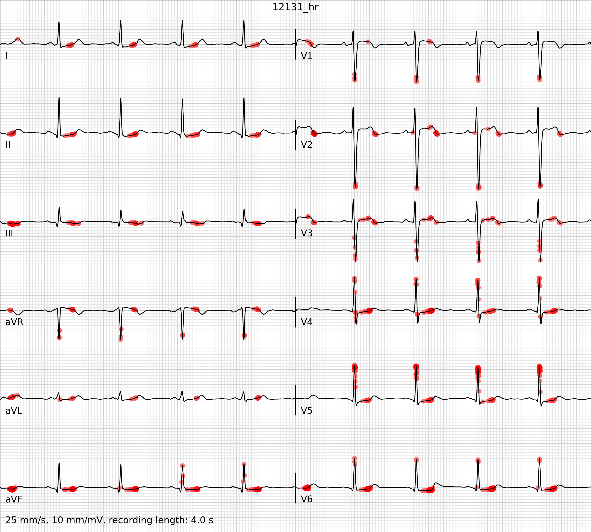
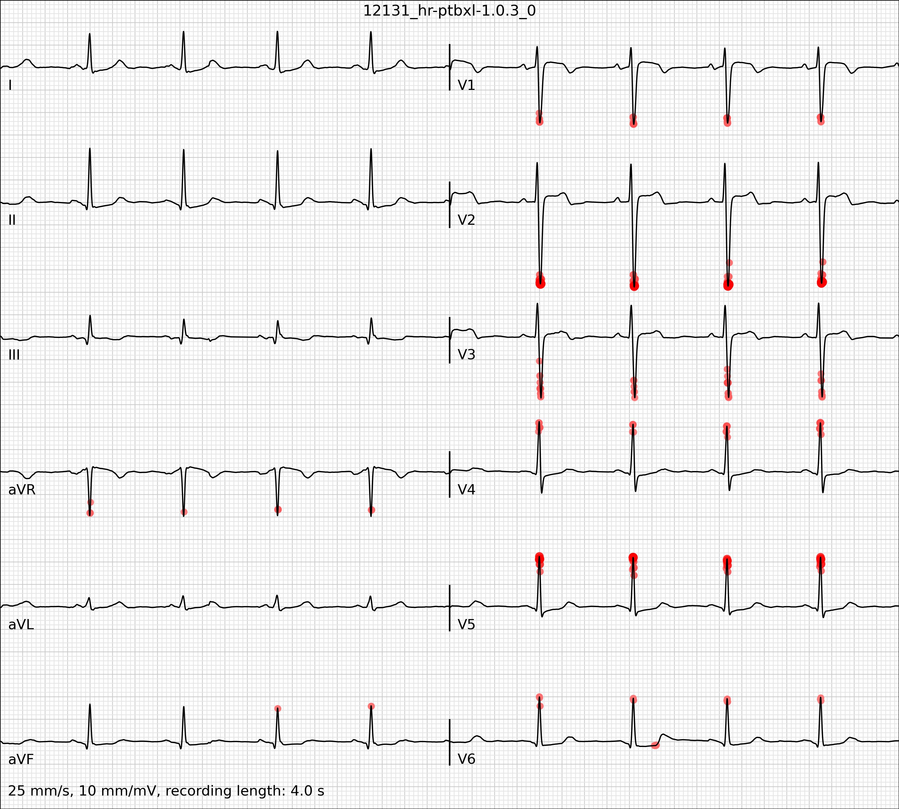
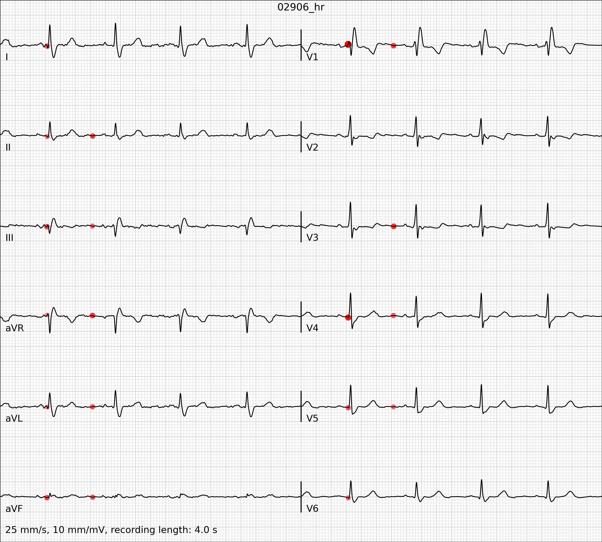
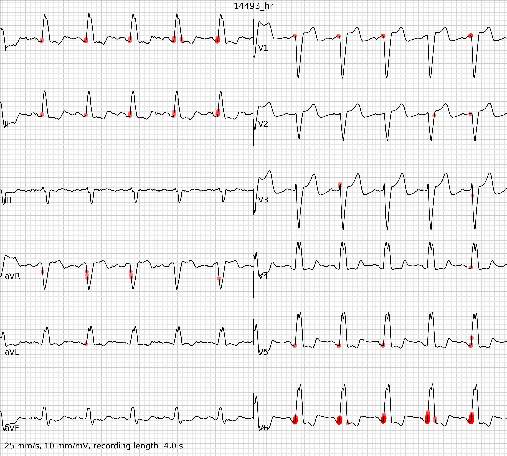
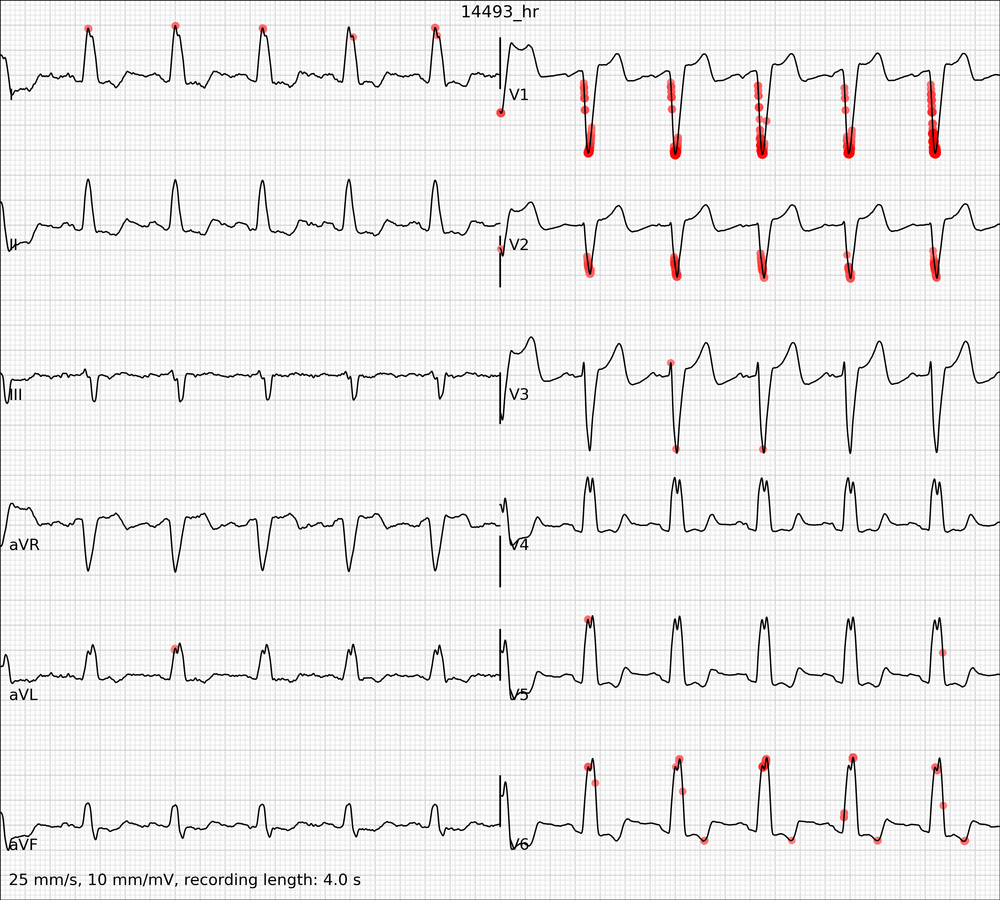

# Towards Trustworthy AI in Cardiology (AIME2024)

This repository contains supplementary material accompanying the paper entitled "Towards Trustworthy AI in Cardiology: A Comparative Analysis of Explainable AI Methods for Electrocardiogram Interpretation Towards Trustworthy AI in Cardiology" submitted to the *22nd International Conference on Artificial Intelligence in Medicine, Salt Lake City, Utah, USA, July 9-12 2024* (AIME2024).
https://doi.org/10.1007/978-3-031-66535-6_36

Citation:

```bibtex
@InProceedings{Gumpfer2024,
  author    = {Gumpfer, Nils and Borislav Dinov and Samuel Sossalla and Michael Guckert and Jennifer Hannig},
  booktitle = {22nd International Conference on Artificial Intelligence in Medicine, AIME 2024, Salt Lake City, UT, USA, July 9 - 12, 2024, Proceedings},
  title     = {{Towards Trustworthy {AI} in Cardiology: A Comparative Analysis of Explainable {AI} Methods for Electrocardiogram Interpretation}},
  chapter   = {36},
  doi       = {10.1007/978-3-031-66535-6_36},
  editor    = {Finkelstein, Josef and Moskovitch, Robert and Parimbelli, Enea},
  pages     = {350--361},
  publisher = {Springer Nature Switzerland AG},
  series    = {Lecture Notes in Computer Science},
  volume    = {14845},
  month     = {07},
  year      = {2024},
}
```

## Data
We used electrocardiograms from the PTB-XL database: https://physionet.org/content/ptb-xl/1.0.3/
To download the records used in the examples below and to setup the pip environment, run the ``` prepare.sh ``` script. For the experiments, we used Python 3.10.

## Models
The readily trained models are provided in ``` .h5 ``` format for evaluation purposes.

## Code
For the calculation of explanations, we used the ``` sign-xai ``` and ``` shap ``` python packages:
- SIGN: https://github.com/nilsgumpfer/SIGN-XAI
- SHAP: https://github.com/shap/shap

You can run the ``` example.py ``` script to generate the explanations yourself. 

## Atrioventricular block


*ECG subsample from PTB-XL (Wagner et al., 2020) with heatmap overlay (red) based on XAI method Gradient (Zurada et al., 1994) for predicted class _atrioventricular block_ (prob. 97%).*


*ECG subsample from PTB-XL (Wagner et al., 2020) with heatmap overlay (red) based on XAI method Gradient×Input (Shrikumar et al., 2017) for predicted class _atrioventricular block_ (prob. 97%).*


*ECG subsample from PTB-XL (Wagner et al., 2020) with heatmap overlay (red) based on XAI method Gradient×SIGN (Gumpfer et al., 2023) for predicted class _atrioventricular block_ (prob. 97%).*


*ECG subsample from PTB-XL (Wagner et al., 2020) with heatmap overlay (red) based on XAI method LRP-α₁β₀ (Bach et al., 2015) for predicted class _atrioventricular block_ (prob. 97%).*


*ECG subsample from PTB-XL (Wagner et al., 2020) with heatmap overlay (red) based on XAI method LRP-ε with ε = 0.5 ⋅ σ(x) (Bach et al., 2015) for predicted class _atrioventricular block_ (prob. 97%).*


*ECG subsample from PTB-XL (Wagner et al., 2020) with heatmap overlay (red) based on XAI method LRP-ε SIGN with ε = 0.5 ⋅ σ(x) and SIGN as input layer rule (Gumpfer et al., 2023) for predicted class _atrioventricular block_ (prob. 97%).*


*ECG subsample from PTB-XL (Wagner et al., 2020) with heatmap overlay (red) based on XAI method DeepSHAP (Lundberg et al., 2017) for predicted class _atrioventricular block_ (prob. 97%).*


*ECG subsample from PTB-XL (Wagner et al., 2020) with heatmap overlay (red) based on XAI method GradSHAP (Lundberg et al., 2017) for predicted class _atrioventricular block_ (prob. 97%).*


*ECG subsample from PTB-XL (Wagner et al., 2020) with heatmap overlay (red) based on XAI method Grad-CAM (Selvaraju et al., 2020) for predicted class _atrioventricular block_ (prob. 97%).*


## Myocardial ischemia


*ECG subsample from PTB-XL (Wagner et al., 2020) with heatmap overlay (red) based on XAI method Gradient (Zurada et al., 1994) for predicted class _myocardial ischemia_ (prob. 69%).*


*ECG subsample from PTB-XL (Wagner et al., 2020) with heatmap overlay (red) based on XAI method Gradient×Input (Shrikumar et al., 2017) for predicted class _myocardial ischemia_ (prob. 69%).*


*ECG subsample from PTB-XL (Wagner et al., 2020) with heatmap overlay (red) based on XAI method Gradient×SIGN (Gumpfer et al., 2023) for predicted class _myocardial ischemia_ (prob. 69%).*


*ECG subsample from PTB-XL (Wagner et al., 2020) with heatmap overlay (red) based on XAI method LRP-α₁β₀ (Bach et al., 2015) for predicted class _myocardial ischemia_ (prob. 69%).*


*ECG subsample from PTB-XL (Wagner et al., 2020) with heatmap overlay (red) based on XAI method LRP-ε with ε = 0.5 ⋅ σ(x) (Bach et al., 2015) for predicted class _myocardial ischemia_ (prob. 69%).*


*ECG subsample from PTB-XL (Wagner et al., 2020) with heatmap overlay (red) based on XAI method LRP-ε SIGN with ε = 0.5 ⋅ σ(x) and SIGN as input layer rule (Gumpfer et al., 2023) for predicted class _myocardial ischemia_ (prob. 69%).*


*ECG subsample from PTB-XL (Wagner et al., 2020) with heatmap overlay (red) based on XAI method DeepSHAP (Lundberg et al., 2017) for predicted class _myocardial ischemia_ (prob. 69%).*


*ECG subsample from PTB-XL (Wagner et al., 2020) with heatmap overlay (red) based on XAI method GradSHAP (Lundberg et al., 2017) for predicted class _myocardial ischemia_ (prob. 69%).*


*ECG subsample from PTB-XL (Wagner et al., 2020) with heatmap overlay (red) based on XAI method Grad-CAM (Selvaraju et al., 2020) for predicted class _myocardial ischemia_ (prob. 69%).*


## Right bundle branch block


*ECG subsample from PTB-XL (Wagner et al., 2020) with heatmap overlay (red) based on XAI method Gradient (Zurada et al., 1994) for predicted class _right bundle branch block_ (prob. 99%).*


*ECG subsample from PTB-XL (Wagner et al., 2020) with heatmap overlay (red) based on XAI method Gradient×Input (Shrikumar et al., 2017) for predicted class _right bundle branch block_ (prob. 99%).*


*ECG subsample from PTB-XL (Wagner et al., 2020) with heatmap overlay (red) based on XAI method Gradient×SIGN (Gumpfer et al., 2023) for predicted class _right bundle branch block_ (prob. 99%).*


*ECG subsample from PTB-XL (Wagner et al., 2020) with heatmap overlay (red) based on XAI method LRP-α₁β₀ (Bach et al., 2015) for predicted class _right bundle branch block_ (prob. 99%).*


*ECG subsample from PTB-XL (Wagner et al., 2020) with heatmap overlay (red) based on XAI method LRP-ε with ε = 0.5 ⋅ σ(x) (Bach et al., 2015) for predicted class _right bundle branch block_ (prob. 99%).*


*ECG subsample from PTB-XL (Wagner et al., 2020) with heatmap overlay (red) based on XAI method LRP-ε SIGN with ε = 0.5 ⋅ σ(x) and SIGN as input layer rule (Gumpfer et al., 2023) for predicted class _right bundle branch block_ (prob. 99%).*


*ECG subsample from PTB-XL (Wagner et al., 2020) with heatmap overlay (red) based on XAI method DeepSHAP (Lundberg et al., 2017) for predicted class _right bundle branch block_ (prob. 99%).*


*ECG subsample from PTB-XL (Wagner et al., 2020) with heatmap overlay (red) based on XAI method GradSHAP (Lundberg et al., 2017) for predicted class _right bundle branch block_ (prob. 99%).*


*ECG subsample from PTB-XL (Wagner et al., 2020) with heatmap overlay (red) based on XAI method Grad-CAM (Selvaraju et al., 2020) for predicted class _right bundle branch block_ (prob. 99%).*


## Left bundle branch block


*ECG subsample from PTB-XL (Wagner et al., 2020) with heatmap overlay (red) based on XAI method Gradient (Zurada et al., 1994) for predicted class _left bundle branch block_ (prob. 98%).*


*ECG subsample from PTB-XL (Wagner et al., 2020) with heatmap overlay (red) based on XAI method Gradient×Input (Shrikumar et al., 2017) for predicted class _left bundle branch block_ (prob. 98%).*


*ECG subsample from PTB-XL (Wagner et al., 2020) with heatmap overlay (red) based on XAI method Gradient×SIGN (Gumpfer et al., 2023) for predicted class _left bundle branch block_ (prob. 98%).*


*ECG subsample from PTB-XL (Wagner et al., 2020) with heatmap overlay (red) based on XAI method LRP-α₁β₀ (Bach et al., 2015) for predicted class _left bundle branch block_ (prob. 98%).*


*ECG subsample from PTB-XL (Wagner et al., 2020) with heatmap overlay (red) based on XAI method LRP-ε with ε = 0.5 ⋅ σ(x) (Bach et al., 2015) for predicted class _left bundle branch block_ (prob. 98%).*


*ECG subsample from PTB-XL (Wagner et al., 2020) with heatmap overlay (red) based on XAI method LRP-ε SIGN with ε = 0.5 ⋅ σ(x) and SIGN as input layer rule (Gumpfer et al., 2023) for predicted class _left bundle branch block_ (prob. 98%).*


*ECG subsample from PTB-XL (Wagner et al., 2020) with heatmap overlay (red) based on XAI method DeepSHAP (Lundberg et al., 2017) for predicted class _left bundle branch block_ (prob. 98%).*


*ECG subsample from PTB-XL (Wagner et al., 2020) with heatmap overlay (red) based on XAI method GradSHAP (Lundberg et al., 2017) for predicted class _left bundle branch block_ (prob. 98%).*


*ECG subsample from PTB-XL (Wagner et al., 2020) with heatmap overlay (red) based on XAI method Grad-CAM (Selvaraju et al., 2020) for predicted class _left bundle branch block_ (prob. 98%).*


## References

Bach, S., Binder, A., Montavon, G., Klauschen, F., Müller, K.R., Samek, W.: On pixel-wise explanations for non-linear classifier decisions by layer-wise relevance propagation. *PLoS One* 10(7), 1–46 (2015)

Gumpfer, N., Prim, J., Keller, T., Seeger, B., Guckert, M., Hannig, J.: SIGNed explanations: Unveiling relevant features by reducing bias. *Information Fusion* 99, 101883 (2023)

Lundberg, S.M., Lee, S.: A unified approach to interpreting model predictions. In: Guyon, I., von Luxburg, U., Bengio, S., Wallach, H.M., Fergus, R., Vishwanathan, S.V.N., Garnett, R. (eds.) *Advances in Neural Information Processing Systems 30: Annual Conference on Neural Information Processing Systems 2017, December 4-9, 2017, Long Beach, CA, USA*. pp. 4765–4774 (2017)

Selvaraju, R.R., Cogswell, M., Das, A., Vedantam, R., Parikh, D., Batra, D.: GradCAM: Visual explanations from deep networks via gradient-based localization. *Int. J. Comput. Vision* 128(2), 336–359 (2020)

Shrikumar, A., Greenside, P., Kundaje, A.: Learning important features through propagating activation differences. In: Precup, D., Teh, Y.W. (eds.) Proceedings of the 34th International Conference on Machine Learning, ICML 2017, Sydney, NSW, Australia, 6-11 August 2017. *Proceedings of Machine Learning Research*, vol. 70, pp. 3145–3153. PMLR (2017)

Wagner, G.S., Macfarlane, P., Wellens, H., Josephson, M., Gorgels, A., Mirvis, D.M., Pahlm, O., Surawicz, B., Kligfield, P., Childers, R., Gettes, L.S.: AHA/ACCF/HRS recommendations for the standardization and interpretation of the electrocardiogram - part VI: Acute ischemia/infarction. *Circulation* 119(10), e262–e270 (2009)

Wagner, P., Strodthoff, N., Bousseljot, R.D., Kreiseler, D., Lunze, F.I., Samek, W., Schaeffter, T.: PTB-XL, a large publicly available electrocardiography dataset. *Scientific Data* 7(1), 154 (2020)

Zurada, J., Malinowski, A., Cloete, I.: Sensitivity analysis for minimization of input data dimension for feedforward neural network. In: *Proceedings of IEEE International Symposium on Circuits and Systems - ISCAS ’94*. vol. 6, pp. 447–450 vol.6 (1994)